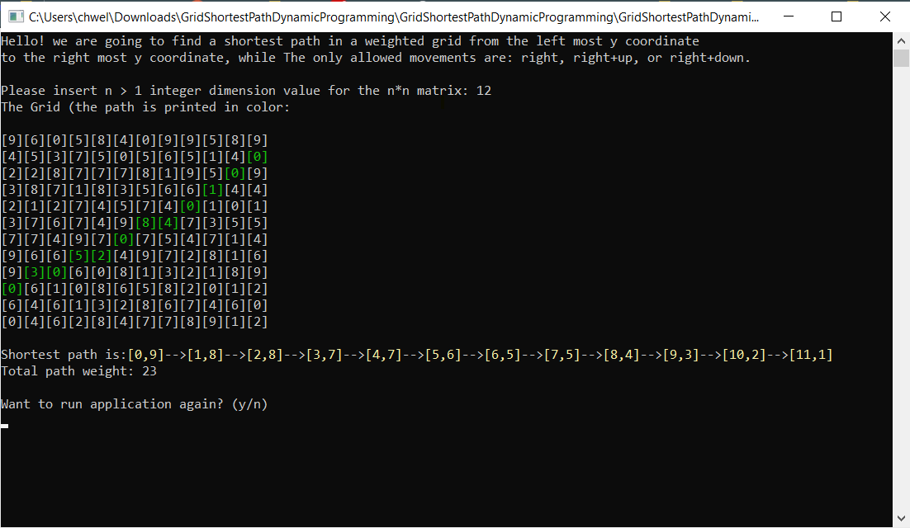

# GridShortestPathDynamicProgramming

Demnostration of a dynamic programming algorithm for finding a shortest path on a weighted grid:
each cell in the grid has a weight, the movement on the grid is from left to right, 
where the only allowed movements are either right, right-down, and right-up. 
The goal is to move from the left-most column in the grid to the right-most column of the grid, 
through cells which sum up to be the lowest total weight possible. 

## Screenshot Sample on a 10X10 Grid: 

